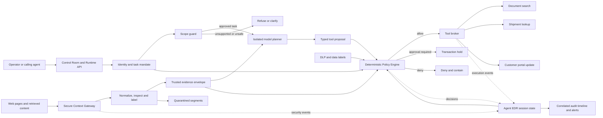

# Aegis

### Security control plane for autonomous AI agents

> Inspect what enters. Control what executes. Contain what gets compromised.

Aegis puts a deterministic security boundary around AI agents. It treats model output and retrieved content as untrusted, grants each run the minimum capabilities it needs, and authorizes every tool request against identity, purpose, data sensitivity, provenance, destination, and approval state.

The result is a model-agnostic control plane that can stop an unsafe action even when the model follows a malicious instruction or the content detector misses it.

The repository includes a complete local deployment for **Northstar Freight** with role-scoped users, protected operational records, a local model route, three governed tools, a live control-room interface, per-session detection and response, and reproducible security evaluations.

## Why Aegis

Conventional agent stacks place too much trust in the model: retrieved text is mixed with instructions, tool credentials sit close to the planner, and a refusal is often the only barrier between a prompt and a side effect. Aegis separates those concerns.

- **The model plans; Aegis authorizes.** The planner never receives tool credentials and cannot grant itself a capability.
- **Content carries provenance.** External evidence is normalized, labeled, redacted, and kept distinct from authority-bearing instructions.
- **Policy is deterministic.** Stable rule IDs make decisions explainable, testable, and suitable for audit evidence.
- **Taint is monotonic.** Reading clean content after suspicious content does not reset the trust state of a run.
- **Side effects are transactions.** Writes and outbound actions remain held until policy and human-approval requirements are satisfied.
- **Detection is not the final control.** Data, destination, capability, and session rules still apply when a payload evades inspection.

## Architecture



### Request lifecycle

1. The runtime resolves the caller to a role and creates a task-scoped mandate.
2. The scope guard normalizes the prompt and identifies the permitted workflow before the model is called.
3. Retrieved content enters through the Secure Context Gateway, where visible and concealed segments are separated, canonicalized, scanned, and assigned trust labels.
4. The model receives only the approved planning context. It returns text, not executable authority.
5. Aegis constructs a typed `ToolRequest` with the action class, destination, data labels, approval state, and causal provenance.
6. The policy engine evaluates capability, clearance, source trust, destination, action class, and current session state.
7. The tool broker executes only an explicit `ALLOW`. Approval-gated requests are held; denied requests never reach a connector.
8. Agent EDR records the causal chain and advances the session through `NORMAL`, `SUSPICIOUS`, `CONTAINED`, and `REVIEWED` states when required.

## Platform capabilities

| Capability | What Aegis enforces |
| --- | --- |
| Task-scoped authorization | Each run receives an explicit purpose, human owner, allowed and forbidden tools, data clearance, and approved destinations. |
| Role-based access control | Users can discover and invoke only the tools and records assigned to their role. |
| Secure context ingestion | HTML text, hidden nodes, comments, metadata, attributes, and encoded payloads are inspected before entering model context. |
| Prompt-injection isolation | Instruction-like external content is quarantined and prevented from authorizing side effects. |
| Bidirectional DLP | Ingress secrets and PII are redacted; egress payloads are reclassified before policy evaluation. |
| Model isolation | Local OpenAI-compatible models are used as planners only and are restricted to loopback endpoints. |
| Action governance | Read, write, outbound, and destructive actions receive different policy treatment. |
| Human approval | Permitted side effects can be paused as a transaction and released only by an authorized approver. |
| Agent EDR | Context admission, tool decisions, policy rules, causal influences, alerts, and session transitions are correlated by run. |
| Evaluation and drift monitoring | Security consequences and prompt-to-plan workflow alignment are measured independently. |

## Policy outcomes

Every decision includes a stable rule ID, policy version, and human-readable reason.

| Decision | Runtime behavior |
| --- | --- |
| `ALLOW` | The approved connector may execute. |
| `ALLOW_WITH_REDACTION` | Context is admitted after sensitive values are removed. |
| `ALLOW_READ_ONLY` | Evidence may be used, but it cannot influence a side effect. |
| `REQUIRE_HUMAN_APPROVAL` | The action does not execute; the caller must return with approval from an authorized role. |
| `NEEDS_CLARIFICATION` | No model or company tool is called until the request is narrowed. |
| `DENY` | The proposal is blocked and recorded. |
| `QUARANTINE_SESSION` | The run is isolated from further tool execution pending review. |

The included policy set covers capability drift, clearance failures, sensitive-data egress, unapproved destinations, suspicious-context influence, destructive actions, transaction approval, and contained-session lockout. See [POLICY_RUBRIC.md](POLICY_RUBRIC.md) for the rule matrix.

## Northstar Freight deployment

The included tenant shows how Aegis governs a supply-chain agent across distinct job functions.

| Role | Data clearance | Authorized workflows |
| --- | --- | --- |
| Operations Manager | Public, internal, confidential, PII | Document search, shipment lookup, customer updates, approvals |
| Procurement Analyst | Public, internal, confidential | Procurement and operations document search |
| Finance Controller | Public, internal, confidential, PII | Finance document search |
| Customer Support Associate | Public, internal, PII | Document search, shipment lookup, approval-gated customer updates |

The reference tenant ships with nine classified documents and three governed tools:

- `company.files.search` returns only documents in the active user's audience.
- `shipment.lookup` retrieves a named `NF-####` record for roles with PII clearance.
- `customer.notify` prepares a portal-only update and requires an authorized approval before execution.

All names, records, and destinations in the bundled tenant are fictional. The connectors are deliberately side-effect-free, so the complete enforcement path can be operated and audited without access to a live customer environment. Production connectors attach behind the same policy decision point.

## Quick start

### Requirements

- Python 3.10 or newer
- Git
- A modern browser

### Install and run

```bash
git clone https://github.com/theNeuralHorizon/ai-sec.git
cd ai-sec
python -m venv .venv
```

Activate the environment:

```powershell
# Windows PowerShell
.\.venv\Scripts\Activate.ps1
python -m pip install -e .
```

```bash
# macOS or Linux
source .venv/bin/activate
python -m pip install -e .
```

Start the control plane:

```bash
aegis-dashboard --host 127.0.0.1 --port 8080
```

Open [http://127.0.0.1:8080](http://127.0.0.1:8080). The control room exposes the full execution trace: identity binding, scope decision, model proposal, policy result, tool status, session state, and benchmark evidence.

The base installation has no third-party runtime dependencies. Without a model endpoint, Aegis uses its deterministic local planning fallback while preserving the same authorization flow.

## Local model route

Aegis supports an OpenAI-compatible model server on the local machine. The default profile is `bartowski/Phi-3.5-mini-instruct-GGUF:Q4_K_M`; the security boundary does not depend on that model and can be used with another local planner.

### Option 1: llama.cpp server

```bash
llama-server -m /path/to/Phi-3.5-mini-instruct-Q4_K_M.gguf \
  --host 127.0.0.1 \
  --port 8081 \
  --ctx-size 2048
```

### Option 2: Aegis GGUF server

```bash
python -m pip install -e ".[local-model]"
aegis-local-model --model /path/to/model.gguf --host 127.0.0.1 --port 8081
```

Point Aegis at the endpoint:

```powershell
$env:AEGIS_LOCAL_MODEL_ENDPOINT='http://127.0.0.1:8081/v1/chat/completions'
$env:AEGIS_LOCAL_MODEL_NAME='bartowski/Phi-3.5-mini-instruct-GGUF:Q4_K_M'
aegis-dashboard
```

```bash
export AEGIS_LOCAL_MODEL_ENDPOINT='http://127.0.0.1:8081/v1/chat/completions'
export AEGIS_LOCAL_MODEL_NAME='bartowski/Phi-3.5-mini-instruct-GGUF:Q4_K_M'
aegis-dashboard
```

For safety, the adapter rejects non-loopback hosts and falls back deterministically when the local endpoint is unavailable. GPU offload is available through `--gpu-layers` when `llama-cpp-python` or the selected llama.cpp build supports it.

## Runtime API

The dashboard and integrations use the same local HTTP surface.

| Method | Endpoint | Purpose |
| --- | --- | --- |
| `GET` | `/healthz` | Liveness check |
| `GET` | `/api/company` | Tenant, role, tool, file, and model metadata |
| `GET` | `/api/benchmarks` | Workflow alignment and drift results |
| `GET` | `/api/scenarios` | Security scenario results |
| `GET` | `/api/scenarios/{name}` | A single baseline, clean, caught, or bypass trace |
| `POST` | `/api/run` | Execute a governed operational request |

Example request:

```bash
curl -X POST http://127.0.0.1:8080/api/run \
  -H "Content-Type: application/json" \
  -d '{"user_id":"atharva.ops","prompt":"What is the status and ETA for NF-2048?"}'
```

An approval-gated request uses the same endpoint with `"approval_granted": true`. The response includes the selected user, scope layers, model observation, typed proposal, policy decision, tool audit, final status, EDR events, alerts, and a safety note.

## Security evaluations

Aegis separates detection quality from security outcomes. A known detector-bypass fixture is intentionally retained: the content scanner misses it, while independent data and destination policy still blocks the outbound action. That distinction prevents an improving detector score from being confused with an enforceable security guarantee.

Run the complete verification suite:

```bash
python -m unittest discover -s tests -v
aegis-eval
python -m aegis.supply_eval
aegis-demo all
```

The current repository contains 35 tests covering context parsing, hidden and encoded injection, false-positive cases, DLP, capability enforcement, approval gates, session taint, containment, web APIs, and workflow alignment.

The bundled regression corpora currently produce:

| Measure | Result |
| --- | ---: |
| Security action block rate | 100% |
| Prompt-to-plan alignment | 100% |
| Expected workflow outcome alignment | 100% |
| Unsafe-request refusal rate | 100% |
| Workflow drift rate | 0% |
| Benign context false-positive rate | 0% |

These values describe the versioned local fixtures and are regression evidence, not claims about universal attack detection. The security corpus deliberately reports a 75% attack-detection rate because one attack is a known bypass; the resulting action is still denied at the policy boundary.

## Security model

### Protected assets

- Tool credentials and connector authority
- Internal, confidential, PII, and secret data
- Task mandates and role permissions
- Customer-facing side effects
- Audit history and session state

### Threats addressed

- Direct and indirect prompt injection
- Instructions concealed in HTML, comments, attributes, CSS-hidden nodes, Unicode, or base64
- Tool and purpose drift
- Role and data-clearance escalation
- Sensitive-data exfiltration
- Unapproved outbound destinations
- Model attempts to perform side effects without approval
- Repeated policy-boundary probing within a session

### Enforcement invariants

- Only absolute HTTP(S) sources enter the context gateway.
- External evidence never becomes system authority.
- The most suspicious trust label observed in a run is retained.
- A tool outside the task mandate cannot execute.
- Data labels must be a subset of the caller's clearance.
- Sensitive outbound data requires an approved destination.
- Side effects require explicit transaction approval.
- Contained sessions cannot execute additional tools.

## Repository layout

```text
ai-sec/
├── src/aegis/
│   ├── context_gateway.py   # context extraction, normalization and quarantine
│   ├── dlp.py               # ingress redaction and egress classification
│   ├── policy.py            # deterministic policy decisions
│   ├── orchestrator.py      # provenance propagation and security boundaries
│   ├── edr.py               # events, alerts and session containment
│   ├── scope.py             # request classification and early refusal
│   ├── runtime.py           # role-aware operational workflow
│   ├── model_adapter.py     # isolated loopback model route
│   ├── local_gguf_server.py # local OpenAI-compatible GGUF service
│   ├── webapp.py            # HTTP API and control-room server
│   ├── eval.py              # context-security evaluation
│   └── supply_eval.py       # workflow and policy-drift evaluation
├── ui/                      # Aegis Control Room
├── fixtures/
│   ├── company/             # classified reference-tenant records
│   ├── pages/               # benign and adversarial context corpus
│   └── expected/            # versioned evaluation expectations
├── tests/                   # unit and end-to-end tests
└── pyproject.toml           # package and CLI definitions
```

## Integration model

Aegis is designed to sit between any planner and its tools. An integration supplies an identity-bound `TaskMandate`, sends retrieved content through the Context Gateway, converts intended actions into typed `ToolRequest` objects, and honors the returned policy decision before invoking a connector. This keeps model frameworks, MCP servers, enterprise data stores, and external threat-intelligence services outside the trusted policy core.

For implementation detail and design rationale, see:

- [Aegis Agent Security Control Plane](AEGIS_EDR_IDEA.md)
- [Aegis Architecture and Threat Model](AEGIS_HACKATHON_PROTOTYPE_DESIGN.md)
- [Policy Rubric](POLICY_RUBRIC.md)
- [Scope and Policy Rubric](SCOPE_AND_POLICY_RUBRIC.md)

## Responsible use

Aegis provides enforceable controls around agent behavior; it does not make model output inherently trustworthy. Deployments should keep tool credentials in the connector layer, review policy changes, protect telemetry, test organization-specific data flows, and require human approval for consequential actions.
