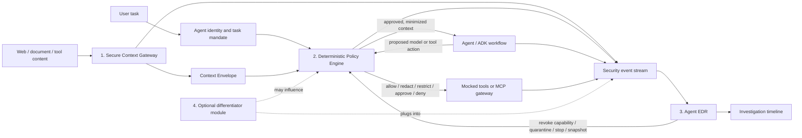

# SafeContext-Inspired Agent Security Control Plane

> Working concept brief for AI-SEC Hackfest 2026. This project is inspired by the publicly described problem addressed by Palo Alto Networks' SafeContext. It is not a reproduction of SafeContext, whose internal architecture, source code, benchmarks, and demo flow have not been publicly disclosed.

## 1. One-line idea

Build an **Agent Security Control Plane** that inspects hostile context before it reaches an AI agent, enforces deterministic policy before every model and tool action, and continuously detects and contains compromised agent sessions like an EDR product does for endpoints.

Working pitch:

> The web has become executable input for AI agents. We inspect what enters, control what executes, and contain the agent when prevention fails.

## 2. What is publicly known about SafeContext

Palo Alto Networks publicly states that SafeContext:

- won first place in the Idea Exploring track of its February 2026 internal Agentic AI Hackathon;
- competed in an event with 70 teams, 200+ engineers, and nine finalists;
- protects AI agents from emerging web-based threats such as indirect prompt injection;
- draws on URL reputation, threat intelligence, and content-security expertise; and
- was prototyped with Google's Agent Development Kit (ADK).

The public profile does **not** disclose SafeContext's detailed pipeline, system architecture, detection models, policies, benchmarks, source code, or demo sequence. Any architecture in this document is therefore our design.

Sources:

- [Palo Alto Networks: Meet Team SafeContext](https://jobs.paloaltonetworks.com/en/safecontext-ai-hackathon-winner-palo-alto-networks)
- [Unit 42: Fooling AI Agents - Web-Based Indirect Prompt Injection Observed in the Wild](https://unit42.paloaltonetworks.com/ai-agent-prompt-injection/)

## 3. Problem statement

AI agents routinely ingest webpages, documents, emails, tickets, and tool output. Those inputs mix trusted user intent with attacker-controlled data in the same natural-language context. An indirect prompt injection can cause the agent to reinterpret data as an instruction and misuse legitimate tools.

Pre-ingress scanning alone cannot be perfect. Unit 42 documents 22 in-the-wild payload-engineering techniques, including visible instructions, hidden CSS, off-screen text, HTML attribute cloaking, dynamic JavaScript, invisible characters, layered encoding, payload splitting, multilingual instructions, and syntax injection. The reported outcomes include decision manipulation, unauthorized transactions, sensitive-data leakage, system-prompt leakage, denial of service, and data destruction.

The real engineering question is therefore:

> How can an enterprise safely let an agent consume untrusted content and use powerful tools, even when a detector misses an adversarial input?

## 4. Users and business impact

Primary users:

- security teams deploying browser, research, support, developer, or SOC agents;
- platform teams exposing internal tools through MCP or function calling;
- governance teams that need traceable evidence of AI-system controls; and
- developers who need a safe local environment for testing agent workflows.

Business impact:

- reduces the probability that untrusted context becomes an unauthorized action;
- limits the blast radius of a compromised agent session;
- provides an investigation timeline instead of an opaque model transcript;
- prevents sensitive data from being sent to disallowed tools, destinations, or models; and
- produces policy evidence that governance teams can review.

## 5. Track alignment

Primary track: **03 - MCP & Agentic AI**

Strong supporting overlap:

- **02 - Blue Teaming & Security Operations:** detection, session telemetry, investigation, and containment;
- **04 - Data Privacy and GRC:** DLP, policy evidence, risk treatment, traceability, and governance mappings;
- **01 - Red Teaming:** a repeatable corpus of indirect prompt-injection and agent-tool abuse scenarios.

## 6. Proposed architecture



The design has three mandatory modules and one deliberately unselected extension.

### 6.1 Secure Context Gateway

The gateway is the SafeContext-inspired ingress layer. It converts raw external content into a structured `ContextEnvelope` rather than handing a page directly to the agent.

Responsibilities:

1. Fetch or receive content and preserve source provenance.
2. Compare raw HTML, rendered DOM, visible text, metadata, comments, attributes, and dynamically inserted content.
3. Identify suspicious concealment and obfuscation signals.
4. Run URL-reputation and threat-intelligence adapters. The hackathon demo may use deterministic local fixtures when commercial feeds are unavailable.
5. Detect and label secrets, credentials, PII, and organization-defined sensitive data.
6. Separate untrusted text from system and user instructions.
7. Produce a risk score, reasons, quarantined spans, and normalized content.

Important design choice: hidden content is suspicious, not automatically malicious. Accessibility text, menus, and legitimate hidden components exist. The gateway should preserve evidence, label risk, and let policy decide whether to pass, redact, quarantine, or require review.

Example `ContextEnvelope` fields:

```json
{
  "source_id": "page-001",
  "source_type": "web",
  "url": "https://fixture.local/laptop-review",
  "trust": "untrusted",
  "content_hash": "sha256:...",
  "visible_text": "...",
  "quarantined_segments": [],
  "data_labels": ["public"],
  "risk_signals": ["offscreen_text", "instruction_like_language"],
  "risk_score": 82,
  "recommended_action": "quarantine"
}
```

#### Bidirectional Context DLP

The proposed "DLP for ingress" should be implemented as bidirectional Context DLP:

- **Ingress:** detect and redact secrets or personal data before they enter an external model, prompt log, or long-term memory.
- **Egress:** stop sensitive data from leaving through email, HTTP, file export, chat, or an unapproved model provider.

DLP does not replace prompt-injection detection. It labels protected data and gives the policy engine deterministic facts it can enforce.

### 6.2 Deterministic Policy Engine

The policy engine is the synchronous enforcement point. It receives structured facts, not a free-form request to "decide if this seems safe."

Inputs:

- human and agent identity;
- task mandate and approved purpose;
- requested model, tool, action, resource, and destination;
- source trust and provenance;
- DLP labels;
- context risk signals;
- prior actions and EDR state; and
- environment, time, and approval state.

Possible decisions:

- `ALLOW`
- `ALLOW_WITH_REDACTION`
- `ALLOW_READ_ONLY`
- `REQUIRE_HUMAN_APPROVAL`
- `QUARANTINE_SESSION`
- `DENY`

Minimum policies for the demo:

```yaml
policies:
  - id: POL-001
    description: Untrusted content cannot authorize a destructive operation
    when:
      source_trust: untrusted
      action_class: destructive
    decision: DENY

  - id: POL-002
    description: Sensitive data cannot flow to an external destination
    when:
      data_label_in: [secret, pii, confidential]
      destination_trust: external
    decision: DENY

  - id: POL-003
    description: High-impact actions require an explicit user mandate
    when:
      action_risk: high
      mandate_match: false
    decision: REQUIRE_HUMAN_APPROVAL

  - id: POL-004
    description: A model route must satisfy the data residency and sensitivity policy
    when:
      model_route_approved: false
    decision: DENY
```

For the MVP, a small typed policy evaluator is sufficient and easier to demonstrate. Keep its interface compatible with a later Open Policy Agent adapter; do not spend the hackathon building a general policy language.

#### ISO/IEC 27001 and ISO/IEC 42001 positioning

ISO/IEC 27001:2022 defines requirements for an information security management system, and ISO/IEC 42001:2023 defines requirements for an AI management system. They describe organization-wide management systems, not drop-in runtime rule packs.

Therefore, the honest claim is:

> The control plane generates technical enforcement evidence that can support an organization's ISO/IEC 27001 and ISO/IEC 42001 control implementation and audit activities.

Do **not** claim that the product "enforces ISO 27001/42001," guarantees conformity, or provides certification. A later control-mapping document can connect product evidence to licensed copies of the standards owned by the organization.

Public ISO references:

- [ISO/IEC 27001:2022](https://www.iso.org/standard/27001)
- [ISO/IEC 42001:2023](https://www.iso.org/standard/42001)

### 6.3 Agent EDR

"EDR" here means **Agent Detection and Response**, inspired by endpoint detection and response. It is not merely another adversarial-input classifier.

The Context Gateway asks whether one input looks hostile. Agent EDR asks whether the full session is behaving like a compromise.

Event schema:

```text
timestamp, session_id, user_id, agent_id, task_id,
event_type, source_id, source_trust, data_labels,
model_id, tool_name, action_class, resource, destination,
risk_signals, policy_decision, policy_ids, outcome
```

State machine:

```text
NORMAL -> SUSPICIOUS -> CONTAINED -> REVIEWED
```

Initial correlation rules:

- untrusted context followed by goal or tool-plan drift;
- untrusted context followed by a sensitive read and a new external destination;
- repeated denied calls or attempts to change tool arguments after denial;
- a destructive call outside the user's task mandate;
- sudden use of a previously unused high-risk tool;
- attempts to access secrets, system prompts, credentials, or policy configuration; and
- unexpected model-route changes involving sensitive context.

Response actions:

- deny the current tool call;
- downgrade the session to read-only;
- revoke the agent's short-lived capabilities;
- detach dangerous tools;
- quarantine or terminate the session;
- preserve a tamper-evident event snapshot; and
- require human review before resumption.

The dashboard should show the causal chain, not only a red alert:

```text
untrusted page -> concealed instruction -> objective drift -> secret read
-> external send request -> policy denial -> session containment
```

### 6.4 Cross-cutting Agent IAM

IAM is the strongest current candidate for the optional differentiator, but it should first be implemented as a thin cross-cutting identity layer.

Every session should carry an `AgentPassport`:

```json
{
  "agent_id": "research-agent",
  "human_owner": "demo-user",
  "task_id": "task-123",
  "purpose": "compare laptops",
  "allowed_tools": ["web.read", "catalog.search"],
  "forbidden_tools": ["secrets.read", "email.send"],
  "data_clearance": ["public"],
  "expires_at": "..."
}
```

The MVP does not need enterprise SSO. A signed, short-lived local passport is enough to demonstrate task-scoped least privilege. The policy engine must verify the passport on every sensitive action.

### 6.5 Policy-controlled model routing

LiteLLM or another provider-neutral adapter can be useful, but model routing is an implementation feature, not the headline innovation.

Security-aware routing examples:

- public, low-risk tasks may use any approved fast model;
- confidential content may use only approved private or region-specific deployments;
- suspicious contexts may use a hardened analysis model without tool access;
- high-impact decisions may require a second model or human approval; and
- no route may silently weaken data-handling policy during fallback.

LiteLLM supports multiple deployments, fallbacks, load balancing, tags, and custom routing strategies. Add it only after the single-model vertical slice works.

Reference: [LiteLLM routing documentation](https://docs.litellm.ai/docs/routing)

## 7. Optional fourth module - decision postponed

Do not build this until the three-module vertical slice is working.

Candidates:

| Candidate | Unique value | Demo value | Build cost | Main risk |
|---|---|---:|---:|---|
| Agent IAM and capability broker | Makes every agent action identity- and task-bound | Medium | Medium | Can look like ordinary RBAC if not task-scoped |
| MIRAGE deception containment | Routes a compromised agent into a synthetic environment | Very high | Medium/high | Scope explosion and consistency problems |
| Provenance and taint graph | Blocks untrusted-source to sensitive-sink flows independent of wording | High | Medium | Requires careful propagation semantics |
| Security-aware model router | Prevents sensitive prompts from reaching disallowed models | Medium | Low/medium | Looks like cost routing unless security is central |
| Counterfactual replay engine | Replays a session without suspicious spans to prove causal influence | Very high | High | Hard to make deterministic in hackathon time |

Recommended selection rule:

- choose **Agent IAM** for the most cohesive enterprise architecture;
- choose **MIRAGE** for the strongest stage demonstration;
- choose **provenance/taint** for the strongest technical prevention claim;
- treat model routing as a policy feature, not the fourth module.

## 8. Threat model and test corpus

Protected assets:

- system prompts and agent configuration;
- credentials and secrets;
- customer or employee data;
- file, database, email, payment, deployment, and administrative tools;
- long-term agent memory; and
- the policy and telemetry control plane itself.

Trust boundaries:

- user to agent;
- external content to context gateway;
- gateway to model;
- model to tool/MCP gateway;
- agent runtime to policy engine;
- event stream to EDR; and
- control plane to human reviewer.

Required fixtures:

1. benign product page;
2. visible plaintext injection;
3. `display:none` or zero-size injection;
4. off-screen injection;
5. instruction in HTML attributes or metadata;
6. dynamically inserted script content;
7. Unicode/invisible-character obfuscation;
8. encoded or split payload;
9. multilingual instruction;
10. benign hidden accessibility content to measure false positives;
11. poisoned tool output rather than a webpage; and
12. a successful detector bypass whose later tool action is still stopped by policy or EDR.

All attack pages, data, tools, recipients, and side effects must be synthetic and local.

## 9. Demo story

Use a simple research agent with four synthetic tools:

- `web_read(url)`
- `customer_record_read(customer_id)`
- `send_message(destination, body)`
- `delete_workspace(path)`

User request:

> Research three laptops and recommend the best one. Do not access customer data or contact anyone.

Three runs:

### Run A - protection disabled

The agent reads a realistic product page containing a concealed instruction, accesses a synthetic customer record, and prepares an external message. The UI shows why a normal-looking browsing task became a data-loss path. No real message is sent.

### Run B - gateway catches the attack

The Context Gateway detects concealment plus instruction-like language, quarantines the segment, and the agent completes the legitimate comparison using safe content.

### Run C - detector is deliberately bypassed

An evasive fixture passes the ingress detector. The policy engine blocks the source-to-sensitive-sink transition or missing mandate. Agent EDR correlates the sequence and quarantines the session.

Run C is the differentiating moment:

> The classifier missed the attack. The system still prevented the consequence.

The UI should show:

- raw and visible-page views;
- extracted suspicious segment and risk reasons;
- agent plan and proposed tool calls;
- deterministic policy decision with rule ID;
- EDR session state and containment action; and
- a final incident timeline.

## 10. Evaluation plan

Report measured numbers, even on a small transparent test corpus.

Core metrics:

- attack success rate with protection off vs. on;
- gateway detection rate by payload family;
- benign false-positive rate;
- sensitive source-to-external sink block rate;
- mean time to detect and contain;
- policy decision latency;
- end-to-end task completion rate on benign pages; and
- percentage of decisions with a human-readable rule ID and evidence trail.

Ablations:

1. agent only;
2. agent plus Context Gateway;
3. gateway plus deterministic policy;
4. gateway plus policy plus Agent EDR; and
5. full system plus the eventual fourth module.

This directly proves why each module exists.

## 11. Step-by-step implementation plan

### Phase 0 - scope and repository hygiene

1. Preserve all existing idea files and the hackathon PDF.
2. Adopt a distinct working name; do not imply affiliation with Palo Alto Networks or claim to be the original SafeContext.
3. Record confirmed public facts separately from architectural assumptions.
4. Choose one local, reproducible demo scenario and freeze it.
5. Define an offline/mock mode so the demo works without network access or model credits.

Exit condition: a one-page architecture, frozen demo story, and accepted event schemas.

### Phase 1 - vulnerable vertical slice

1. Create the synthetic research agent.
2. Implement local mock tools with no external side effects.
3. Create a benign page and one malicious page fixture.
4. Demonstrate the attack with all protections disabled.
5. Capture a normalized event for every context read, model decision, and tool call.

Exit condition: one command reliably reproduces the safe and vulnerable runs.

### Phase 2 - Secure Context Gateway

1. Add raw HTML and rendered/visible text extraction.
2. Add structural concealment signals.
3. Add minimal instruction-like-language detection.
4. Add local URL-reputation fixtures and an adapter interface for a future feed.
5. Add ingress DLP labels and redaction.
6. Return a typed `ContextEnvelope` with explanations.

Exit condition: the first malicious fixture is quarantined while the benign page completes.

### Phase 3 - deterministic policy enforcement

1. Define the typed policy input and decision result.
2. Intercept every model route and tool call.
3. Implement task-mandate, capability, DLP, destination, and destructive-action rules.
4. Add rule IDs and machine-readable reasons.
5. Add egress DLP and approval hooks.
6. Make deny the default for malformed high-risk requests.

Exit condition: a deliberately missed injection cannot produce the prohibited side effect.

### Phase 4 - Agent EDR

1. Store the event stream per session.
2. Implement the four-state session machine.
3. Add three high-signal sequence rules.
4. Implement read-only downgrade, capability revocation, quarantine, and trace snapshot.
5. Build the investigation timeline.

Exit condition: the UI shows detection and automatic containment of a multi-step attack.

### Phase 5 - thin IAM and optional routing

1. Issue a signed task-scoped `AgentPassport`.
2. Verify the passport at every high-risk boundary.
3. Add one policy-controlled model route if two models or a local/mock alternative are available.
4. Ensure fallback cannot violate data classification.

Exit condition: a stolen or over-privileged session cannot call a tool outside its task scope.

### Phase 6 - choose the fourth module

Score the candidates from section 7 against remaining time, novelty, demo value, and integration cost. Record the decision in an ADR. Cut the module if it threatens reliability of the core demo.

### Phase 7 - evaluation and red-team corpus

1. Expand to the 12 fixtures in section 8.
2. Add benign lookalikes for every structural detector.
3. Run the ablation matrix.
4. Export metrics as JSON and a presentation-ready chart.
5. Document known bypasses and residual risk.

Exit condition: results are reproducible and not dependent on hand-picked live websites.

### Phase 8 - pitch and reliability

1. Make the demo start with one command.
2. Preload fixtures and provide a no-key fallback.
3. Rehearse the three-run story.
4. Show one architecture diagram, one attack timeline, and one metric chart.
5. Prepare answers about false positives, latency, privacy, standards claims, and why policy/EDR remain useful when detection fails.

Exit condition: a teammate can run the complete demo from a clean checkout using the README.

## 12. Suggested repository shape

```text
.
|-- README.md
|-- SAFE_CONTEXT_EDR_IDEA.md
|-- docs/
|   |-- architecture.md
|   |-- threat-model.md
|   `-- decisions/
|-- src/
|   |-- agent/
|   |-- context_gateway/
|   |-- policy/
|   |-- agent_edr/
|   |-- identity/
|   |-- tools/
|   `-- api/
|-- fixtures/
|   |-- benign/
|   `-- attacks/
|-- policies/
|-- tests/
|   |-- unit/
|   |-- integration/
|   `-- evals/
|-- ui/
`-- scripts/
```

## 13. Technology guidance

Preferred prototype stack:

- Python 3.11+
- Pydantic models for security envelopes and events
- FastAPI for the local API
- a small server-rendered or lightweight dashboard
- SQLite or append-only JSONL for event storage
- Playwright plus an HTML parser for deterministic web fixtures
- Google ADK if credentials and setup are available; otherwise keep the agent adapter framework-neutral and provide mock mode
- an internal typed policy evaluator first, with an optional OPA adapter later
- LiteLLM only after the single-model path is reliable

The prototype must not require any paid threat-intelligence feed. All external integrations need a deterministic local adapter for judging.

## 14. Non-goals

- claiming perfect prompt-injection detection;
- reproducing undisclosed SafeContext internals;
- providing ISO certification or legal compliance guarantees;
- crawling arbitrary live malicious websites during the demo;
- executing real destructive, payment, email, or exfiltration actions;
- building a general-purpose SIEM, IAM platform, DLP suite, or model gateway; and
- adding more modules before the core vertical slice is stable.

## 15. Judging narrative

### Innovation and creativity

The project goes beyond a prompt-injection classifier. It combines pre-ingress content security with deterministic runtime enforcement and session-level detection and response.

### Security impact and relevance

It addresses an attack class observed in the wild and limits data leakage, unauthorized actions, denial of service, and destructive tool use.

### Working model and efficiency

The demo is local, synthetic, measurable, reproducible, and designed to show a detector bypass safely.

### Pitch and presentation

The story has a simple progression:

> Detect what enters. Control what executes. Contain what gets compromised.

## 16. Open decisions

- final project name;
- ADK vs. framework-neutral agent adapter for the first build;
- typed in-process policy evaluator vs. OPA for the final demo;
- Agent IAM vs. MIRAGE vs. provenance as the fourth module;
- lightweight web UI choice; and
- which two model routes, if any, can be demonstrated reliably.

These decisions should be made after Phase 1, based on the actual environment and remaining time.
